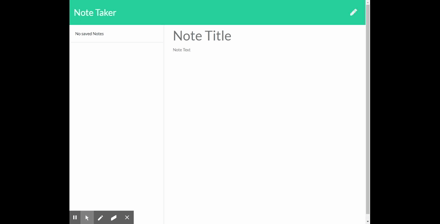

# NoteTaker

Deployed at 

### Descritption

This app allows you to write notes and save them. You can delete and create a new notes as you please.

### Installation

required installation
npm install express nodemon

### Usage

use to test and practice express skills

### Table of Contents

  [Description](###Descritption)

  [Installation](###Installation)

  [Usage](###Usage)

  [License](###License)

  [Contributing](###Contributions)

  [Tests](###Tests)

### License

License under [MIT License](License)

### Contributions

none

### Tests

none

### Questions and Suggestions

Feel free to check out my Github:

[github.com/francisN21](https://github.com/francisN21)

You can reach out to me for questions and suggestions at ininorones@gmail.com
